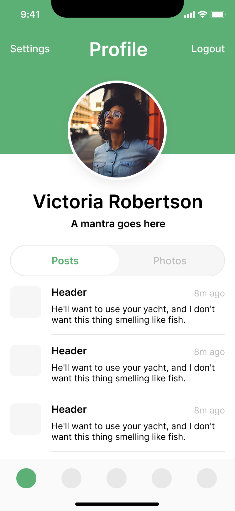
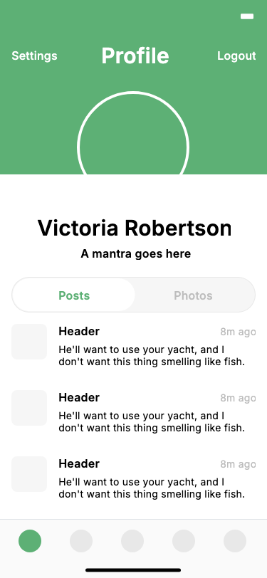

# Evaluation / Benchmark

How faithfully does the pipeline turn a Figma screen into Flutter? This page
records the headline metrics on real and synthetic screens, with reference vs.
generated images and the per-node geometry report.

All numbers below come from actual runs (live Figma REST fetch or saved
`figma_raw.json`), not estimates. Reproduce any of them with the commands in
each case.

## What the metrics mean

| Metric | How it's computed | Good = |
| --- | --- | --- |
| **flutter analyze** | `flutter analyze` exit code in `flutter_app/` (`--validate`). | pass (0 issues) |
| **visual score** | `0.6·SSIM + 0.4·(1 − pixelMAE)`, 0–100, candidate render resized to the Figma PNG (`--visual-validate`). Coarse gate — text regions use a real bundled Inter font but pixel scoring is still font-sensitive. | higher |
| **geometry error** | Per-node signed `dx/dy/dw/dh` between the rendered widget rect (`KeyedSubtree` global rect) and Figma's `absoluteBoundingBox`, normalized to the root (`--geometry-validate`). **Font-independent and attributable.** | mean → 0px |
| **components** | Distinct reusable widget classes the planner lifts (after structural dedup). | — |
| **reuse ratio** | component references ÷ distinct components. | higher |

> Geometry is the trustworthy fidelity signal (signed, per-element,
> font-independent); the pixel `visual_score` is a coarse regression gate that
> can't reward fine local fixes. See `ARCHITECTURE.md` / CLAUDE.md steps 23–27
> for why.

## How to reproduce

```bash
# Local fixture (deterministic, no token, no network):
python -m agent.cli \
  --input examples/figma_sample.json \
  --output flutter_app/lib/generated_screen.dart \
  --validate

# Live node + full evaluation (needs FIGMA_TOKEN):
python -m agent.cli \
  --figma-url "https://www.figma.com/design/<KEY>/<file>?node-id=151-546" \
  --figma-token "$FIGMA_TOKEN" \
  --output flutter_app/lib/generated_screen.dart \
  --validate --visual-validate --geometry-validate --save-run

# Reproduce Case 1 fully offline (no token) from the saved raw response +
# saved reference PNG — yields the 87.2 / 0.35px numbers below:
python -m agent.cli \
  --input runs/2026-06-04-profile-posts/figma_raw.json \
  --output flutter_app/lib/generated_screen.dart \
  --validate \
  --visual-validate --reference-image runs/2026-06-05-profile-posts/visual_reference.png \
  --geometry-validate --save-run

# Aggregate metrics across saved runs/:
python -m agent.metrics
```

---

## Case 1 — Profile Screen

- **Source:** live Figma node `151:546` (`Profile/Posts`, file `CjqVljuG65EUroiUFhSwxT`); reproducible offline from `runs/2026-06-04-profile-posts/figma_raw.json`.
- **Canvas:** 375 × 812 (mobile portrait).
- **Generated components:** **19** (after structural dedup — 4 duplicate content blocks collapsed into 1, referenced 4×).
- **flutter analyze:** ✅ **pass** (No issues found).
- **visual score:** **87.2** (SSIM 0.827).
- **geometry mean error:** **0.3px** (max 4.4px; `dx = dy = dh = 0` on every node; residual is `dw ≤ 4px` sub-pixel Inter glyph-advance rounding on a few text labels).
- **Known unsupported (graceful):**
  - 2 diagonal `LINE` chevrons — path geometry we don't reproduce → skipped (warning).
  - 6 degenerate signal/wifi bars (1–3px wide) — too thin for the Figma render API → same-size blank placeholders, so layout stays correct.
  - True icon vectors (status bar 9:41 / battery / notch) **are** rasterized via the node-render API.

| Figma reference | Generated Flutter |
| --- | --- |
|  |  |

**Geometry diff report** (`geometry_report.json`, actual run — tolerance 1.0px):

```
matched        : 46 nodes (of 83 Figma / 46 rendered)
deviations >tol: 6
max offset     : 4.38px
mean offset    : 0.35px

node                 dx     dy     dw     dh
A mantra goes here   +0.0   +0.0   +4.38  +0.0
Victoria Robertson   +0.0   +0.0   +2.77  +0.0
Profile              +0.0   +0.0   +1.88  +0.0
Search               +0.0   +0.0   +1.21  +0.0
8m ago               +0.0   +0.0   +1.20  +0.0
Header               +0.0   +0.0   +1.04  +0.0
```

Every deviation is `dx = dy = dh = 0` — only text **width** drifts (sub-pixel
Inter glyph-advance rounding, worst on the longest string). Positions and
heights are pixel-exact.
This is the result of the deterministic line-height fix (CLAUDE.md step 27) and
the node-visibility fix (step 28) that lifted the score from 79.1 → 87.2.

---

## Case 2 — Feed Screen

- **Source:** live Figma node `144:2663` (same file as Case 1, structurally different: Back/Feed/Filter header, search field, post list, bottom tab bar). Never tuned for — pure generalization test.
- **Canvas:** 375 × 812.
- **flutter analyze:** ✅ **pass** (No issues found, no overflow).
- **visual score:** **90.0** (SSIM 0.866).
- **geometry mean error:** **0.2px** (max 1.2px; only 4 nodes > 1px, all `dw = +1px` text glyph-rounding; `dx = dy = dh = 0`).
- **Known unsupported (graceful):** 2 `BOOLEAN_OPERATION` nodes — unsupported type → skipped with a warning (non-fatal), like the diagonal vectors.

| Figma reference | Generated Flutter |
| --- | --- |
|  |  |

**Geometry diff report** (summarized):

```
deviations >tol: 4   (tolerance 1.0px)
max offset     : 1.2px
mean offset    : 0.2px
axis breakdown : dx = 0, dy = 0, dh = 0  on every node
                 dw = +1px on 4 text nodes
```

A second live screen scoring **90** with sub-pixel geometry confirms the
pipeline generalizes beyond the screen it was developed on (Case 1 = 87).

---

## Case 3 — Synthetic generalization demos

Three structurally-different hand-authored fixtures, used to flush out codegen
blind spots (each surfaced a real bug — `$`-escaping and auto-layout main-axis
hug; CLAUDE.md step 35). All three: `flutter analyze` ✅ pass, render without
overflow, real Inter glyphs.

| Login (`examples/figma_login.json`) | Product grid (`examples/figma_product_grid.json`) | Settings (`examples/figma_settings.json`) |
| --- | --- | --- |
|  |  |  |

| Demo | Exercises | analyze |
| --- | --- | --- |
| Login | centered form, `layoutAlign:STRETCH` fields, full-width button | ✅ pass |
| Product grid | `Row` of `Column` cards, colored image blocks, `$`-prices | ✅ pass |
| Settings | grouped section cards, `spaceBetween` rows, `LINE` dividers | ✅ pass |

---

## Aggregate (`python -m agent.metrics`)

Across the local `runs/` artifacts (gitignored — regenerate with `--save-run`).
Metrics with no underlying data report `n/a` rather than a fabricated number.

| Metric | Value |
| --- | --- |
| Runs analyzed | 3 |
| Compile success rate | **1.0** (1/1 validated runs) |
| Repair success rate | n/a *(no run needed repair)* |
| Mean visual score | 83.1 *(mixes 2 pre-fix runs; latest run = **87.2**)* |
| Mean generated LOC | 461 |
| Component reuse ratio | 1.177 |

> The mean visual score is diluted by two earlier runs captured before the
> step-27/28 fidelity fixes. The latest `--validate --visual-validate
> --geometry-validate` run on Profile/Posts (current code) reproduces
> **87.2 / SSIM 0.827** and **mean 0.35px** geometry — i.e. the Case 1 numbers
> above are reproducible from the saved `figma_raw.json`, no token required.

## Known limitations (all screens)

- **Diagonal `LINE` / `BOOLEAN_OPERATION` vectors** — path geometry not
  reproduced; skipped with a warning (non-fatal).
- **Degenerate (≤3px) vectors** — no Figma render URL; blank placeholders keep
  layout correct.
- **Text width** — `dw ≤ 4px` residual from Inter glyph-advance rounding
  between Figma's rasterizer and Flutter; positions/heights are exact.
- **Visual repair** — the screenshot diff has no LLM consumer yet (DeepSeek v4
  is text-only); see the "Roadmap: Repair Agent" section in the README.
